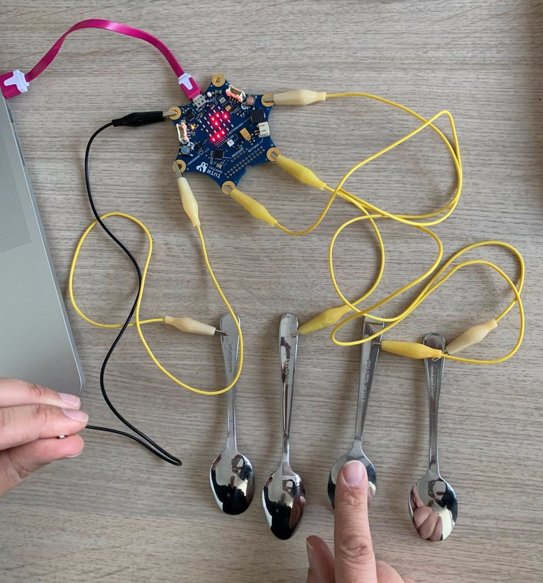
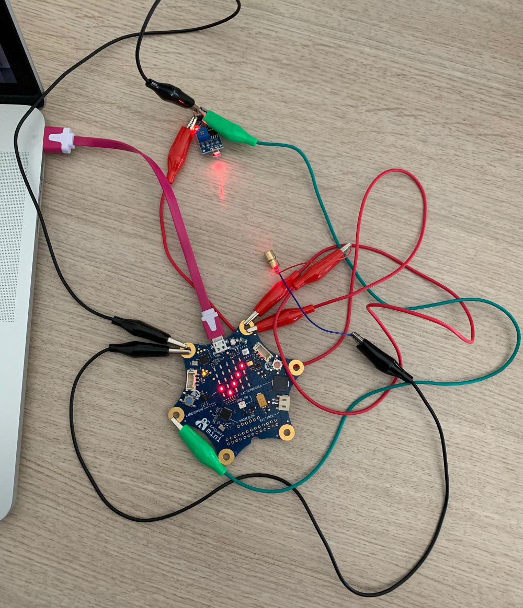
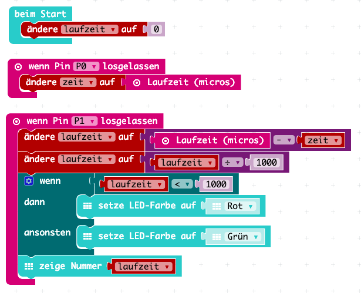

= Calliope bei Devoxx4Kids

Der https://calliope.cc[Calliope] ist ein kleiner Microcomputer, der einen schnellen und spielerischen Einstieg in die Welt der Programmierung bietet. Obwohl er bewusst einfach gehalten wurde enthält er bereits eine Menge Sensoren und Ausgabemöglichkeiten, um eindrucksvolle Programme zu schreiben. 

Hier bei der Devoxx4Kids stellen wir zwei einfache Projekte mit dem Calliope vor, die neben dem Programmieren auch ein wenig 'Bastelei' erfordern.

Zum Programmieren benötigt man einen Computer mit USB Anschluss und einen Zugang zum Internet. Die Umgebung zum Programmieren des Calliope läuft in jedem modernen Internetbrowser. Rufe https://calliope.cc auf und klicke auf 'Los gehts' und dann 'Editor'. Wir nutzen hier https://makecode.calliope.cc/ als Editor.

== Zutaten

- 1 x Calliope mini (ca. 35€-40€)
- 5 x Krokodilklemmen 50cm (ca. 4€ je 10Stk) 
- Aluminiumfolie (ca. 2€ je Rolle)

Optional für den Geschwindigkeitsmesser

- Laserdioden 5mW 5V (ca. 5€ je 5Stk)
- Fotowiderstand (ca. 9€ je 6Stk)

== Elektronisches Piano

image:images/calliope-klavier-prog.png[Programm zum Calliope Klavier,300,role="right"]

=== Der Aufbau 

In diesem Projekt machen wir aus unserem Calliope ein elektronisches Piano. Dazu nutzen wir die 4 Eingabe Pins. Das sind die vergoldeten Ecken des 'Sterns' und den kleinen Lautsprecher.

Hier schließen wir jeweils an jeden Pin mit einer Nummer (0 - 3) eine Krokodilklemme an. Auf der jeweils anderen Seite der Klemme wird ein leitender Gegenstand geklemmt, z.B. ein Streifen Alufolie, ein Metalllöffel, ein Schlüsselbund, ...
Um den Stromkreis zu schließen klemmen wir eine Krokodilklemme an den Minus Pin und auf der anderen Seite wieder an einen Streifen Alufolie.

=== Das Programm

Das Programm ist zunächst sehr einfach, kann aber beliebig erweitert werden. Wenn ein Eingabe Pin gedrückt wird, spiele eine bestimmte Note. 

Da wir 4 Eingabe Pins haben können wir schon mal 4 unterschiedliche Noten abspielen. Und durch Drücken oder Loslasssen z.B. von Knopf B können wir schon doppelt so viele Noten spielen und haben damit eine Oktave. Damit lassen sich schon kleine Lieder spielen wie 'Alle meine Entchen' oder 'Ode an die Freude'.

== Geschwindigkeitsmesser

=== Der Aufbau

Mit diesem Projekt bauen wir einen 'Blitzer' aus dem Straßenverkehr nach. Dazu nutzen wir zwei Eingabe Pins für den Fotowiderstand, das 5x5 Display zum Anzeigen der Geschwindigkeit und die RGB LED zum Anzeigen, ob zu schnell gefahren wurde.

Hinweis: In dem abgebildeten Aufbau ist nur eine Laser LED und ein Fotowiderstand zu sehen. Ansonsten wurde das recht unübersichtlich.

==== Das Programm

Dieses Programm ist etwas komplizierter, da wir Variablen einbauen müssen, um uns die Zeit zu merken.

